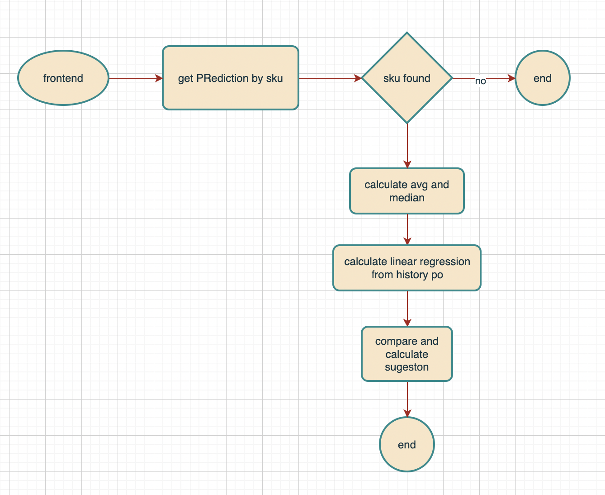

# Price Prediction Sample Application

## Architecture

In this simple example of price prediction, we utilize a straightforward API-based architecture.


### Bababos Backend

Bababos backend is a simple Golang application that opens an API to the frontend. All the logic for price sales prediction resides within this application. The database connection, queries, and logic are included in the repository folder. As the code base grows, these components can be separated for better organization.

in bababos backend there is a flow chart for the key feature of the app



#### why linear regression median and average

The concepts of median and average are fairly straightforward. We aim to find the middle value of prices in the list of prices. If the price is too high, we will have to compete with suppliers offering lower prices. However, if it's too low, our profit margin will be minimal. Therefore, the median and average are shown as suggestions. Both the average and median are based on the price per SKU unit in the price tables.

**why linear regression**

Linear regression is a quiet and simple statistical regression method used for predictive analysis and shows the relationship between the continuous variables. Linear regression shows the linear relationship between the independent variable (X-axis) and the dependent variable (Y-axis), consequently called linear regression. If there is a single input variable (x), such linear regression is called simple linear regression. And if there is more than one input variable, such linear regression is called multiple linear regression.

in this case we just use simple linear regression from price in historical pre order to show the next price for particular sku. 

### three data

With these three data points (average, median, and lr), we will compare the lowest price and provide suggestions to sales regarding the price at which we should sell our product. This price should still be competitive in the market at that time, but also allow for maximum profit margin.

### Bababos Frontend

This is a small Vue.js Single Page Application (SPA) designed to showcase the functionality of the application. Its core function is to allow users to select an SKU_ID and determine the optimal selling price based on various variables and considerations.

### Bababos Data 

This folder serves as a storage location when the application is composed.

## How to Run

### Dockerized

This application is dockerized for easy deployment. You can use Orbstack or Docker Desktop to run it effortlessly.

clone the repository

with https
```bash
git clone https://github.com/prima101112/price-prediction.git
```

and then run the compose

```bash
docker-compose up --force-recreate --build -d
```

that command will run all requirements
- backend (include seeding)
- frontend 
- psql
- migration


## Disable seeding

After the initial run and experimentation with the sample data, you can disable data seeding by commenting out the seed function call in bababos-backend/cmd/server.go:
```
...
seed.Seed()
...
```
By doing this, seeding will be skipped on subsequent runs of the application.

## Architecture

