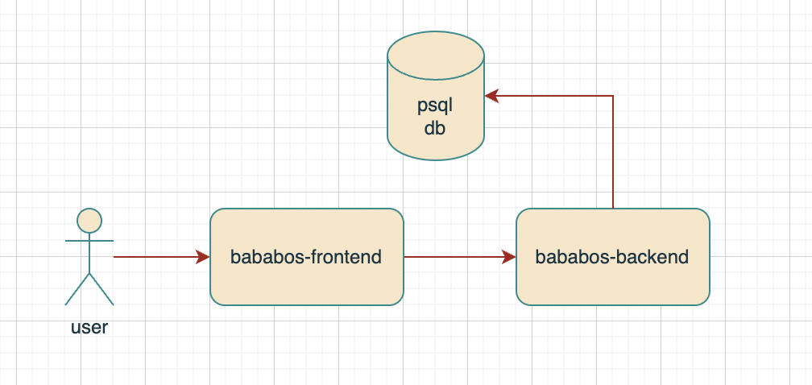

# Price Prediction Sample Application

## Architecture

In this simple example of price prediction, we utilize a straightforward API-based architecture.



### Bababos Backend

Bababos backend is a simple Golang application that opens an API to the frontend. All the logic for price sales prediction resides within this application. The database connection, queries, and logic are included in the repository folder. As the code base grows, these components can be separated for better organization.

### Bababos Frontend

This is a small Vue.js Single Page Application (SPA) designed to showcase the functionality of the application. Its core function is to allow users to select an SKU_ID and determine the optimal selling price based on various variables and considerations.

## Bababos Data 

This folder serves as a storage location when the application is composed.

## How to Run

### Dockerized

This application is dockerized for easy deployment. You can use Orbstack or Docker Desktop to run it effortlessly.

```bash
docker-compose up --force-recreate --build -d
```

that command will run all requirements
- backend (include seeding)
- frontend 
- psql
- migration


## Disable seeding

After the initial run and experimentation with the sample data, you can disable data seeding by commenting out the seed function call in bababos-backend/cmd/server.go:
```
...
seed.Seed()
...
```
By doing this, seeding will be skipped on subsequent runs of the application.

